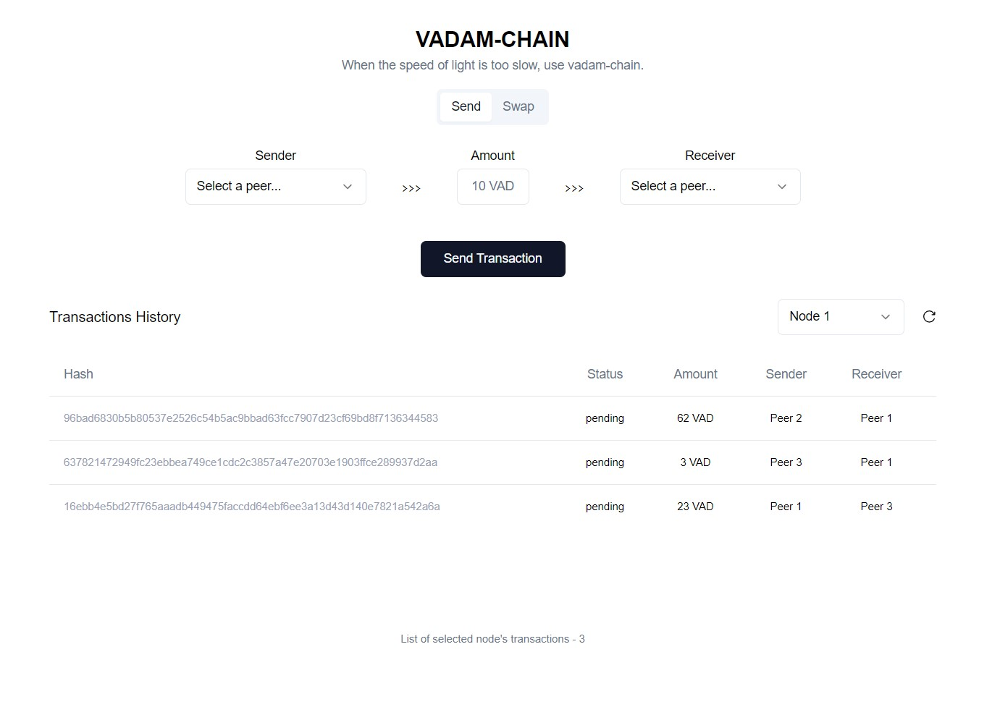

# VDAM-CHAIN

M9 - Fundamentals of Blockchain | BCN23-24 - CS409 - Bulat Nasrulin

## Info

This project is the outcome of a 3 week long blockchain course in Harbour.Space University.  
We built a simple blockchain from scratch and built functions which get operated by a frontend.



## Project Set Up

**Note:** Ensure that both Python and Node are installed when running this code locally.

-   Python >= 3.8
-   Node >= 16

### 1) Create a virtual environemnt

```bash
python -m venv .venv # Run in root directory
```

### 2) Activate it if IDE doesn't automatically

```bash
source .venv/bin/activate # on Mac, run in root directory
source .venv/Scripts/activate # on Windows, run in root directory
```

### 3) Install required packages for python

```bash
pip install -r requirements.txt # Run in root directory
```

### 4) Install required packages for node

```bash
npm install # Run in src/frontend directory
```

## Run the code

### To build the frontend

```bash
npm run build # Run in src/frontend directory
```

### To start develop server for the frontend

```bash
npm run start # Run in src/frontend directory, runs on localhost:3000
```

### To start main python application

```bash
python run_local.py # Run in src direcotry, starts frontend on localhost:8000
```

## Weekly Reports & More

| #            | Link                                                                                             |
| ------------ | ------------------------------------------------------------------------------------------------ |
| Week 1       | [Link to our report](WEEK_ONE_REPORT.md)                                                         |
| Week 2       | [Link to our report](WEEK_TWO_REPORT.md)                                                         |
| Week 3       | [Link to our report](WEEK_THREE_REPORT.md)                                                       |
| Song         | [Link to our song](vadam-song.mp3)                                                               |
| Presentation | [Link to our presentation](https://www.canva.com/design/DAGDUgZT9lw/WW8MgNDddYKqcL8sA3_pKw/edit) |
